Some frequently used Plots in R
================

-   [VERTICAL BARCHART](#vertical-barchart)
-   [HORIZONTAL BARCHART](#horizontal-barchart)
-   [STACKED BARCHART](#stacked-barchart)
-   [STACKED BARCHART (DODGED)](#dodged-barchart)
-   [STACKED BARCHART (ABSOLUTE)](#absolute-stacked-barchart)
-   [LINE CHART](#line-chart)
-   [HEATMAP / TILE MAP](#heat-map)
-   [BOXPLOT](#box-plot)
-   [SCATTERPLOT](#scatterplot)
-   [ANIMATED SCATTERPLOT](#animated-scatterplot)
-   [TREE MAP](#tree-map)
-   [FACET WRAP](#facet-wrap)
-   [FACET GRID](#facet-grid)

##### *Loading required Libraries and Datasets:*

``` r
odi_data <- read.csv("D:/datasets/odi-batting.csv")
tweets_data <- read.csv("D:/datasets/narendramodi_tweets.csv")
election_data <- read.csv("D:/datasets/parliament.csv")
iot_data <- read.csv("D:/datasets/data_iot_temperature.csv")

library(dplyr)
library(lubridate)
library(ggplot2)
library(treemap)
```

#### VERTICAL BARCHART

------------------------------------------------------------------------

``` r
Top_10_Party_names <- election_data %>% filter(Position == 1) %>% group_by(PARTY) %>%
  summarise(WINS = n()) %>% arrange(desc(WINS)) %>% select(PARTY) %>% head(10)

v_barchart <- election_data %>% filter(YEAR == 2009, PARTY %in% Top_10_Party_names$PARTY) %>% 
  group_by(PARTY) %>% summarise(Total_contestants = n())

v_barchart <- v_barchart %>% 
  ggplot(aes(reorder(PARTY,-Total_contestants),Total_contestants, fill = PARTY)) +
  geom_col(width = 0.5) + 
  xlab("PARTY") + ylab("No. of Contestants") + 
  ggtitle("Partywise Total Contestants in 2009") +
  geom_text(position = "stack", aes(label = Total_contestants))

v_barchart  
```
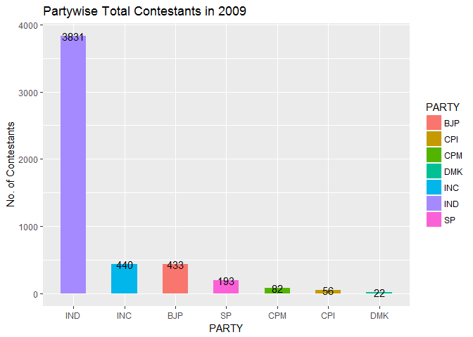

#### HORIZONTAL BARCHART

------------------------------------------------------------------------

``` r
h_barchart <- election_data %>% filter(YEAR == 2009, Position %in% c(1,2)) %>% 
  group_by(PC, NAME) %>% summarise(TotalVotes = sum(VOTES)) %>% group_by(PC) %>% 
  arrange(PC, desc(TotalVotes)) %>% mutate(diff_votes = c(-diff(TotalVotes), NA)) %>%
  na.omit() %>% mutate(perc_margin = diff_votes*100/(TotalVotes - diff_votes)) %>%
  arrange(desc(perc_margin)) %>% head(10)

h_barchart <- h_barchart %>% ggplot(aes(reorder(NAME,perc_margin),perc_margin, fill = NAME)) + 
                             geom_bar(stat = "identity") + 
                             xlab("Contestant Name") + ylab("Percentage Margin") + 
                             coord_flip() + 
                             theme(legend.position = "none", 
                                   axis.text.y = element_blank(), 
                                   axis.ticks.y = element_blank()) +
  geom_text(position = position_stack(vjust = 0.8), aes(label = NAME), size = 2)

h_barchart  
```

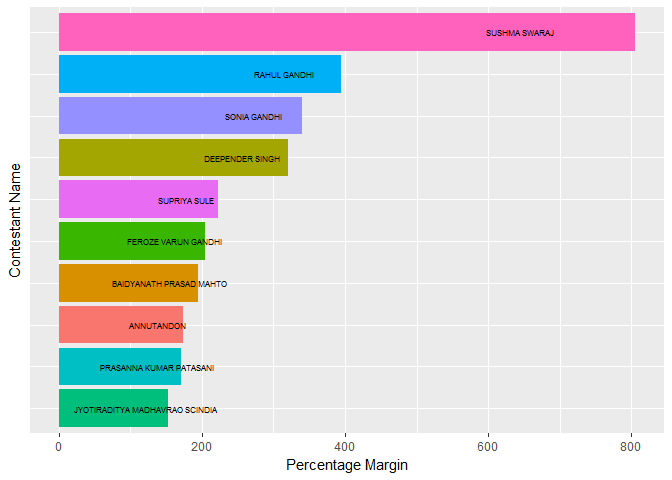

#### STACKED BARCHART

------------------------------------------------------------------------

``` r
stacked <- iot_data %>% filter(temperature < 25|temperature > 30) %>% 
  mutate(Temp_Limit = 
           if_else(temperature >= 31,"Exceeds Upper Limit (30)","Under Lower Limit (25)")) %>% 
  group_by(day(date), Temp_Limit) %>% summarise(count = n())

stacked <- ggplot(stacked[order(stacked$Temp_Limit, decreasing = T),],
                  aes(`day(date)`,count, fill=Temp_Limit)) + 
                       geom_bar(stat = "identity") + 
                       geom_text(position = position_stack(vjust = 0.5), 
                                 aes(label = count), size = 2.5) + 
                       xlab("Day of the Month") + ylab("Abnormal Temperature Count") +
  ggtitle("Occurences of Abnormal Temperature") +
                       labs(fill = "") + 
                       theme(legend.position = "top") +
                       scale_fill_manual(values = c("#445e87" , "#dbdd49"))

stacked
```

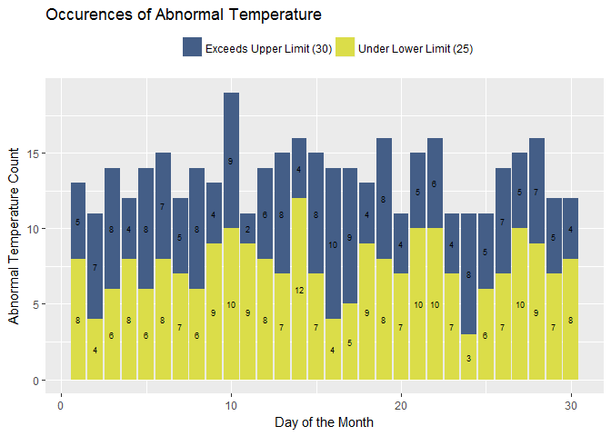

#### DODGED BARCHART

------------------------------------------------------------------------

``` r
dodged <- iot_data %>% filter(temperature < 25|temperature > 30) %>% 
  mutate(Temp_Limit = if_else(temperature >= 31,"Exceeds Upper Limit (30)",
                              "Under Lower Limit (25)")) %>% 
  group_by(day(date), Temp_Limit) %>% summarise(count = n())

dodged <- dodged %>% ggplot(aes(`day(date)`,count, fill=Temp_Limit)) + 
  geom_col(width = 1.2, position = "dodge") + xlab("Day of the Month") + 
  ylab("Abnormal Temperature Count") + ggtitle("Occurences of Abnormal Temperature") +
  labs(fill = "") + theme(legend.position = "top") + 
  scale_fill_manual(values = c("#c66c45" , "#80dae5")) + 
  geom_text(aes(label = count), position = position_dodge(width = 1.2), size = 3)

dodged
```

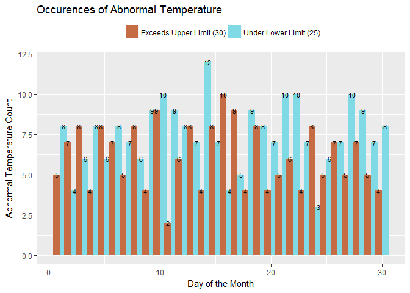

#### ABSOLUTE STACKED BARCHART

------------------------------------------------------------------------

``` r
A2 <- election_data %>% filter(SEX == "M"|SEX == "F") %>% group_by(YEAR,SEX) %>%
  summarise(GenderCount = n()) %>% group_by(YEAR) %>% 
  mutate(TotalCandidatesperYear = sum(GenderCount)) %>% 
  mutate(Gender_Division = round(GenderCount/TotalCandidatesperYear*100)) %>%
  arrange(desc(SEX))

A2 <- ggplot(A2, aes(as.factor(YEAR),Gender_Division, fill = SEX)) + geom_col() +
  xlab("YEAR") + ylab("Gender Split") + 
  ggtitle("Yearwise Percentage of Male and Female Candidates") + 
  scale_fill_manual(values = c("#db4885" , "#6fdb48")) + labs(fill = "")

A2  
```

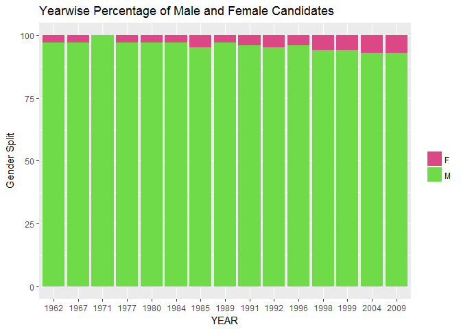

#### LINE CHART

------------------------------------------------------------------------

``` r
linechart <- iot_data %>% group_by(day(date)) %>% 
  summarise(Avg_Temp_per_Day = round(mean(temperature), digits = 2))

linechart <- linechart %>% ggplot(aes(`day(date)`,Avg_Temp_per_Day)) + 
  geom_line(color = "mediumseagreen", size = 0.8) + geom_point(color = "red", size = 0.8) +
  xlab("Day of the Month") + ylab("Average Temperature") + 
  ggtitle("Daywise Avg. Temp. for the month of November") + 
  theme(legend.position = "none")

linechart  
```

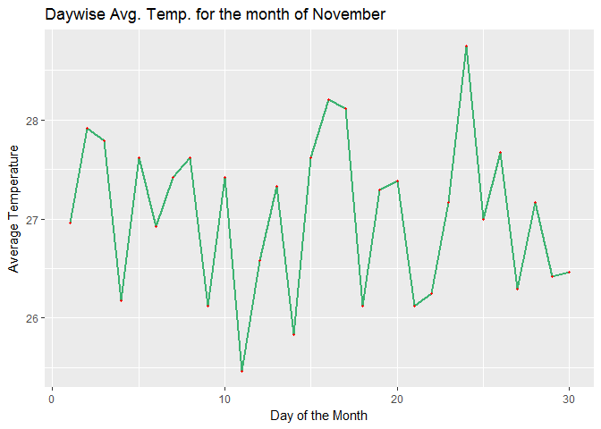

#### HEAT MAP

------------------------------------------------------------------------

``` r
heat_map <- iot_data %>% mutate(day = day(date), hour = hour(date)) %>% 
  group_by(day,hour) %>% mutate(Avg_Temp_per_day = mean(temperature))

library(grDevices)
colorsdefined <- colorRampPalette(c("skyblue","brown1"))(15)

heat_map <- ggplot(heat_map,aes(day,hour, fill = as.factor(Avg_Temp_per_day))) + 
  geom_tile() + xlab("Day of the month") + ylab("Hour of the Day") + 
  ggtitle("Hourly Temperature Readings for the month of November") +
  scale_fill_manual(values = colorsdefined) + labs(fill = "Temperature") + 
  theme(axis.text.x = element_text(angle = 30),axis.text.y = element_text(angle = 30))

heat_map
```

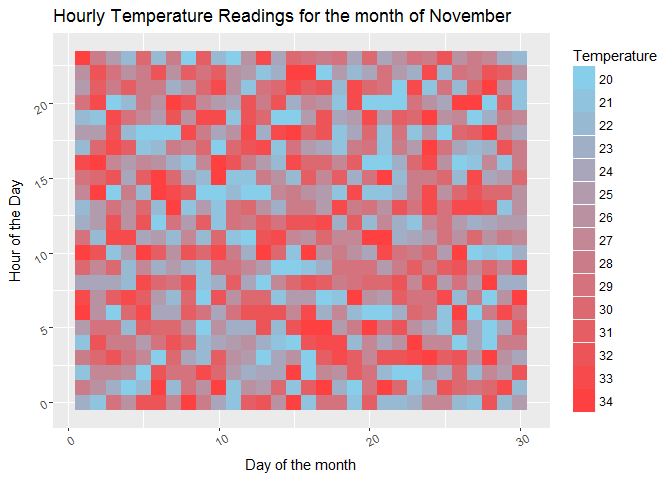

#### BOX PLOT

------------------------------------------------------------------------

``` r
bplot <- iot_data %>% group_by(day(date)) %>% ggplot(aes(`day(date)`,temperature)) +
  geom_boxplot(aes(group = `day(date)`, fill = factor(`day(date)`))) + 
  xlab("Day of the Month") + ylab("Temperature Distribution") + 
  ggtitle("Daywise Distribution of Temperature Readings") + 
  theme(legend.position = "none") + scale_x_continuous(breaks = seq(1,30,1))

bplot  
```

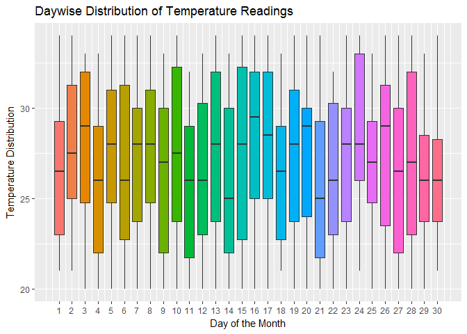

#### SCATTERPLOT

------------------------------------------------------------------------

``` r
#Scatterplot with 2 Quantitative and 1 Categorical Variable

scatter <- ggplot(tweets_data, aes(retweets_count,favorite_count, color = source)) +
  geom_point(cex = 0.8, pch = 1.3, show.legend = T) + xlab("Retweets") + ylab("Likes") +
  ggtitle("Retweets vs. Likes / Device Used") + theme(legend.position = "top")

scatter
```

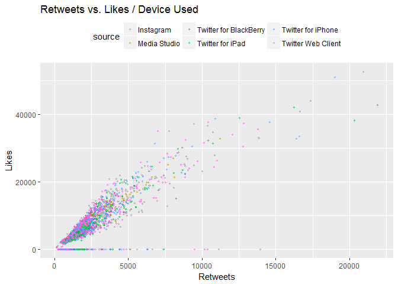

#### ANIMATED SCATTERPLOT

------------------------------------------------------------------------

``` r
#install.packages("devtools")
#devtools::install_github("dgrtwo/gganimate")
library(animation)
library(gganimate)

odi_data$YEAR <- year(mdy(odi_data$MatchDate))
odi_subset <- odi_data %>% filter(Player == "Sachin R Tendulkar")

#ImageMagick, or other such drivers need to be installed on your computer

#Sys.setenv(PATH = paste("C:/Program Files/ImageMagick-7.0.7-Q16/", Sys.getenv("PATH"), sep = ";"))

magickPath <- shortPathName("C:/Program Files/ImageMagick-7.0.7-Q16/magick.exe")
ani.options(convert = magickPath)

plot <- ggplot(odi_subset, aes(Runs, ScoreRate, frame = YEAR,
                               cex = ScoreRate, color = "Red")) + geom_point() +
  theme(legend.position = "none") + 
  ylab("Strike Rate") +
  ggtitle("Sachin's Centuries vs. Strike Rate over the years...")

gganimate(plot, interval = 0.7)
```

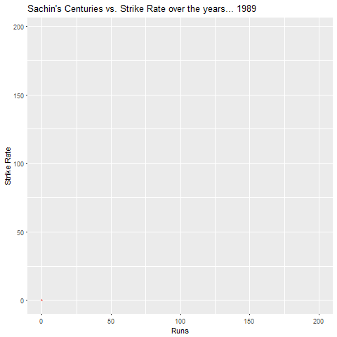

#### TREE MAP

------------------------------------------------------------------------

``` r
#Tree Map with 2 Categorical & 1 Quantitative Variable

library(treemap)

odi_data$Century = odi_data$Runs>99

stadiums = odi_data %>% filter(Century == TRUE) %>% group_by(Player,Ground) %>%
  summarise(`100's` = n()) %>% arrange(desc(`100's`)) %>% group_by(Ground) %>%
  mutate(Total_Centuries_in_Stadium = sum(`100's`)) %>%
  arrange(desc(Total_Centuries_in_Stadium)) %>% filter(Total_Centuries_in_Stadium > 20)


treemap(stadiums, index = c("Total_Centuries_in_Stadium","Ground","Player"), 
        vSize = "Total_Centuries_in_Stadium", 
        title = "Stadiums with most number of ODI Centuries", palette = "Greens") 
```

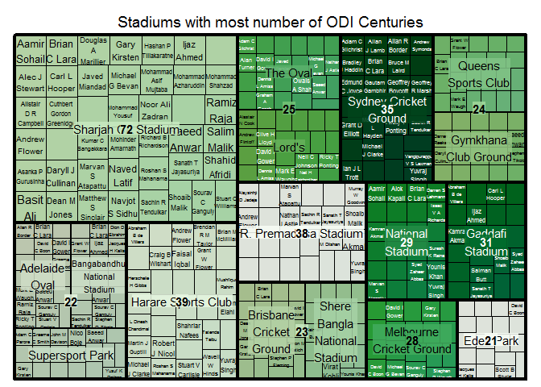

#### FACET WRAP

------------------------------------------------------------------------

``` r
Top_10_Players <- odi_data %>% group_by(Player) %>% summarise(TotalRuns = sum(Runs)) %>% arrange(desc(TotalRuns)) %>% head(10)

odi_data$"100's" <- as.numeric(odi_data$Runs > 99)

odi_data$Year <- year(mdy(odi_data$MatchDate))

Top_10_Players_data <- odi_data %>% filter(Player %in% Top_10_Players$Player) %>%
  group_by(Player, Year) %>%  summarise(Centuries = sum(`100's`))

f_wrap <- ggplot(Top_10_Players_data, aes(Year,Centuries, color = Player)) + geom_point() +
  geom_line() + facet_wrap(~Player, nrow = 5) + theme(legend.position = "none") +
  ggtitle("Centuries of Top 10 Run Scorers over the Years")

f_wrap  
```

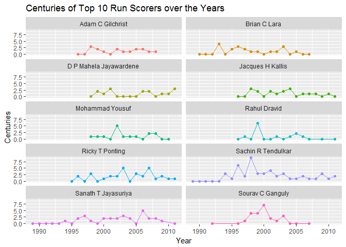

#### FACET GRID

------------------------------------------------------------------------

``` r
Top_5_Players <- odi_data %>% group_by(Player) %>% summarise(TotalRuns = sum(Runs)) %>%
  arrange(desc(TotalRuns)) %>% head(5)

Top_5_Players_data <- odi_data %>% filter(Player %in% Top_5_Players$Player) %>%
  group_by(Player, Year) %>%  summarise(Centuries = sum(`100's`))
  
f_grid <- ggplot(Top_5_Players_data, aes(Year,Centuries, color = Player)) + geom_jitter() +
  geom_smooth(method = "loess") + facet_grid(Player~.) + theme(legend.position = "none") +
  ggtitle("Centuries of Top 5 Run Scorers over the Years")

f_grid
```

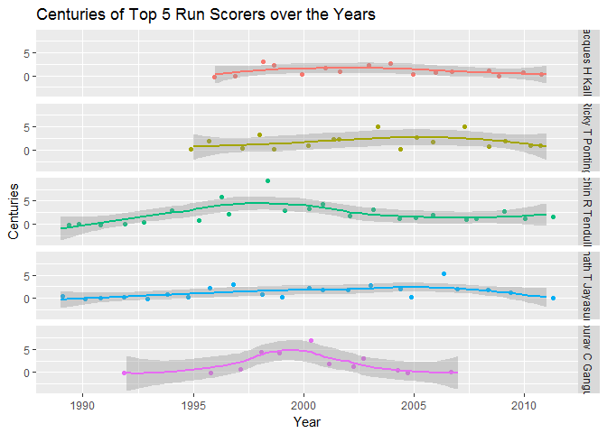
